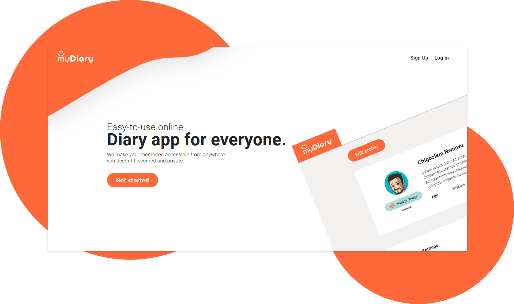

# myDiary-Project

MyDiary is an online journal where users can pen down their thoughts and feelings.

## Development Architecture

In developing myDiary application, the Model-View-Controller (MVC) structure was used, which is the standard software development approach offered by most of the popular web frameworks, is clearly a layered architecture. Just above the database is the model layer, which often contains business logic and information about the types of data in the database. At the top is the view layer, which is often CSS, JavaScript, and HTML. In the middle, you have the controller, which has various rules and methods for transforming the data moving between the view and the model.

## Technologies Used

The development process can be seen as a two part process, the Back-end (server side) and the Front-end (client side).

### Backend

-   [NodeJS](http://nodejs.org/en) is a JavaScript runtime built on Chrome's V8 JavaScript engine.
-   [Express JS](http://express.com) A minimalist web framework.
-   [PostgreSQL](https://www.postgresql.org/) A powerful, open source object-relational database system.
-   [ESLint](eslint.org) provides a pluggable linting utility for JavaScript.
-   [Babel](https://babeljs.io/) used for transpiling codes from ES6 to ES5
-   [Mocha](https://mochajs.org/) Mocha is a feature-rich JavaScript test framework running on [NodeJS](nodejs.org/en) for testing [Javascript](javascript.com) applications.

### Frontend

-   [Vanilla Js](https://developer.mozilla.org/en-US/docs/Web/JavaScript) for frontend design
-   [HTML5](https://developer.mozilla.org/en-US/docs/Web/Guide/HTML/HTML5) for frontend design
-   [CSS3](https://developer.mozilla.org/en-US/docs/Web/CSS/CSS3) for styling frontend
-   [FETCH API](https://developer.mozilla.org/en-US/docs/Web/API/Fetch_API) for making Ajax call from the client to the API

## myDiary Documentation is available

-   [Documentation](https://chigoziem-mydiary-bootcamp-app.herokuapp.com/api-docs)

## Application Features

myDiary is an application that enables users to pen down their thoughts and feelings. So, the following features makes the application personalized like the user truely own it.

### Authentication

-   This creates a web token for the users during signup and login using JsonWebToken (JWT).
-   It authenticate users token to give them access to protected routes of the application.

### User

-   Create a new user by simply providing valid details like Email, FisrtName, LastName, Password and Confirm Password.
-   Upon signup new users can access all routes.
-   Authenticated user can Modify/Updated their details.
-   Authenticated user can on or off their email reminder notification.

### Entries

This is a protected endpoints, users must be authenticated to do the following:

-   Add a new entry
-   Modify/Updated an entry for the user
-   Delete an entry for the user
-   Fetch all entries for a specific user
-   Fectch a single entry for a specific user

### Favorites

This is a protected endpoints, users must be authenticated to do the following:

-   can mark an entry as Favorite or not
-   can fetch all entries marked as favorite
-   can fetch a single entry marked as favorite with an entry ID.

### Categories

This is a protected endpoints, users must be authenticated to do the following:

-   Add a new category
-   Delete an category for the user
-   Fetch all categories for a specific user
-   Fectch a single category for a specific user

## Installation

-   Install [NodeJS](http://nodejs.org/en) and [PostgreSQL](https://www.postgresql.org/) on your computer
-   Clone this repository
-   Navigate to the directoty
-   Install all dependencies with `yarn install`
-   Using `https://chigoziem-mydiary-bootcamp-app.herokuapp.com/createuserstable` migrate the users database table
-   Using `https://chigoziem-mydiary-bootcamp-app.herokuapp.com/createentriestable` migrate the entries database table
-   Using `https://chigoziem-mydiary-bootcamp-app.herokuapp.com/createcategoriestable` migrate the categories database table
-   Start the server by running `yarn start:dev`
-   Build the application by running `yarn heroku-postbuild`

## API LINK

myDiary Application API is readily availble [here](https://chigoziem-mydiary-bootcamp-app.herokuapp.com/api/v1)

## Testing

-   Create a test database of your choice by following the example in .env.sample file
-   Run server-side test with `yarn test`

## Testing with POSTMAN

The API contains different endpoint with their respective payload in the table below

| Endpoints                   | Functions                                            | Payloads                                                  | Requets Method |
| --------------------------- | ---------------------------------------------------- | --------------------------------------------------------- | -------------- |
| /api/v1/auth/signup         | Create a new user                                    | Email, FisrtName, LastName, Password and Confirm Password | POST           |
| /api/v1/auth/login          | Login a user                                         | Email, Password                                           | POST           |
| /api/v1/user                | Get a user details                                   | No payload                                                | GET            |
| /api/v1/user/reminder       | Modifies reminder status                             | favStatus                                                 | PUT            |
| /api/v1/user/update         | Modifies users details                               | about, tel, age, profileImage                             | PUT            |
| /api/v1/entries             | Get all entries for a user                           | No payload                                                | GET            |
| /api/v1/entries             | Post a new diary entry                               | title, description, categoryId                            | POST           |
| /api/v1/entries/:entryId    | Get entry by entryId                                 | No payload                                                | GET            |
| /api/v1/entries/:entryId    | Modify a pending request                             | title, description                                        | PUT            |
| /api/v1/entries/:entryId    | delete an entry for a user by entryId                | No payload                                                | DELETE         |
| /api/v1/entries/:entryId    | delete an entry for a user by entryId                | No payload                                                | DELETE         |
| /api/v1/favorite            | Get all favorite entries for a user by entryId       | No payload                                                | DELETE         |
| /api/v1/favorite/:entryId   | Modify favorite entries status for a user by entryId | favStatus                                                 | PUT            |
| /api/v1/categories          | Post a new category for a user                       | title, colorId                                            | POST           |
| /api/v1/categories/:entryId | Get a single category for a user                     | No payload                                                | GET            |
| /api/v1/categories/:entryId | delete a single category for a user                  | No payload                                                | DELETE         |

## Contribution

-   Fork the repository
-   Make your contributions
-   Write test cases for your contributions
-   Create Pull request against the **develop** branch.

## FAQ

* What language is used to build this application ?
  - The application back-end is entirely built with javascript
  - The front-end is created using HTML, CSS, and JavaScript
* Is this an open-source project ?
  - Yes, Is an open-source project.
* Who can contribute ?
  - Anyone can contribute as long as you would follow the contribution guides outlined above
* Is the application hosted online ?
  - Yes, the application is hosted on heroku platform. You can always visit it via this link [https://chigoziem-mydiary-bootcamp-app.herokuapp.com/api/v1](https://chigoziem-mydiary-bootcamp-app.herokuapp.com/api/v1)
* Does the application have an API ?
  - Yes, The application has a well documented API that can be viewed via a link in the API documentation section above
* Is the application licensed ?
  - Yes, the application and its contents is under MIT license

## User template is available

-   [myDiary-Project](https://mindsworth.github.io/mydiary-project)

## License and Copyright

&copy; Chigoziem Nwaiwu

Licensed under the [MIT License](LICENSE).

